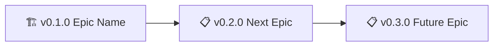

# Global Policy

> ⚠️ **DO NOT EDIT THIS FILE**
>
> This is a global template synced across projects.
> Edit project-specific `backstage/POLICY.md` instead.
> Changes here will be overwritten by sync.
>
> Uses backstage protocol: https://github.com/nonlinear/backstage
>
> ⚠️

> Universal workflow rules that apply across all projects using this backstage system.

**Inspired by:** Elinor Ostrom's polycentric governance framework—multiple centers of power (global/project) with overlapping, not hierarchical, jurisdictions.

---

## Purpose

This file contains **universal, project-agnostic** workflow rules and conventions.

**POLICY.md** (project-specific) extends or overrides these global rules for specific projects.

**How this works:**
- **Global POLICY** = Foundation (universal rules, all projects)
- **Project POLICY** = Customization (local needs, context-specific)
- **Project wins on conflict** (polycentric governance)
- **AI reads both** (merges when compatible, prefers project when not)

**Enforced by:** [backstage-skill](https://clawhub.com/skills/backstage) (runs on "good morning" / "good night")

---

## Formatting Standard

All backstage files (CHECKS, ROADMAP, CHANGELOG, POLICY) must be both **human-readable** (clear, prompt-like, easy to follow) and **machine-readable** (easy for scripts or AI to parse and execute).

**How to format tests and checklists:**

1. **Each test/check should be a short, copy-pasteable code block** (one-liner or small block), with a plain-text explanation and pass/fail criteria immediately after.
2. **No large, monolithic scripts**—keep each check atomic and self-contained.
3. **No markdown formatting or prose inside code blocks.**
4. **All explanations, expected output, and pass criteria must be outside code blocks.**
5. **Backstage files should be easy for both humans and automation to read, extract, and run.**

_Example:_

```bash
python3.11 -c "import llama_index.core; import sentence_transformers"
```

Expected: No error, prints nothing.
Pass: ✅ Dependencies OK

---

## Backstage Installation & Updates

**Backstage is AI-driven - no install scripts.**

### Initial Install

**Clone templates from GitHub:**

```bash
# Create backstage folder
mkdir -p backstage/global

# Download templates
for file in ROADMAP CHANGELOG POLICY HEALTH; do
  curl -fsSL "https://raw.githubusercontent.com/nonlinear/backstage/main/templates/${file}-template.md" \
    -o "backstage/${file}.md"
done

# Download global files
curl -fsSL "https://raw.githubusercontent.com/nonlinear/backstage/main/backstage/global/POLICY.md" \
  -o "backstage/global/POLICY.md"
curl -fsSL "https://raw.githubusercontent.com/nonlinear/backstage/main/backstage/global/HEALTH.md" \
  -o "backstage/global/HEALTH.md"
```

**OR: Clone entire repo and copy backstage/ folder**

### Framework Updates

**Pull latest global files:**

```bash
# Update global POLICY/HEALTH
curl -fsSL "https://raw.githubusercontent.com/nonlinear/backstage/main/backstage/global/POLICY.md" \
  -o "backstage/global/POLICY.md"
curl -fsSL "https://raw.githubusercontent.com/nonlinear/backstage/main/backstage/global/HEALTH.md" \
  -o "backstage/global/HEALTH.md"

# Update prompts (if using OpenClaw)
curl -fsSL "https://raw.githubusercontent.com/nonlinear/backstage/main/.github/prompts/backstage-start.prompt.md" \
  -o ".github/prompts/backstage-start.prompt.md"
# ... repeat for other prompts
```

**What stays unchanged:**
- `backstage/ROADMAP.md` (your epics)
- `backstage/CHANGELOG.md` (your history)  
- `backstage/POLICY.md` (your rules)
- `backstage/HEALTH.md` (your tests)

**Why no install script:** Backstage = files + AI protocol. Just copy files, AI reads POLICY and executes.

---

## Navigation Block & Backstage Files Index

**Every backstage file must have a navigation block** (`> 🤖 ... 🤖`) with links to all backstage files.

**Purpose:** Provides consistent navigation and makes backstage-start workflow aware of file locations.

**Precedence:** When global and project rules conflict:

- **Project POLICY.md** > global/POLICY.md
- **Project HEALTH.md** > global/HEALTH.md
- Local knowledge always wins (polycentric governance)

### README Protection

**README is special** — it's the "spine" of your project:

- **Public-facing:** Outsiders read this to understand your project
- **Vision statement:** Who you are AND who you aim to be
- **People are watching:** Changes are visible to community

**Global rule:** backstage-start can append navigation block but **NOT rewrite README content** without explicit confirmation.

**What needs confirmation:**

- What will change (specific sections/lines)
- How it will change (show before/after)
- Where it will change (exact line numbers)

Only **surgical, pointed changes** allowed—no wholesale rewrites.

**Project can override:** Add to your project POLICY.md if you want to allow automatic README edits (e.g., "allow auto-update of version badges").

### Placement Rules

**AI: The backstage skill/prompt enforces these rules by appending/updating the navigation block automatically:**

**All files (README.md, ROADMAP.md, CHANGELOG.md, HEALTH.md, POLICY.md):**

- **Navigation block at END** (after all content, before final line)
- **No special cases:** All files follow same pattern
- **If `> 🤖` markers exist:** Update content between them
- **If no markers exist:** Append new navigation block at end
- Includes mermaid roadmap diagram (source of truth from ROADMAP.md)

**Logic:**
1. Check if file has `> 🤖` markers
2. If yes: Replace content between markers
3. If no: Append navigation block at end
4. No exceptions, no "top vs end" logic

### Why 🤖 Markers Exist: Future-Proof Format Changes

**The markers are format-agnostic boundaries.**

In the future, navigation block format may change:

- Table → list
- New diagram types
- Different syntax entirely

**How backstage-start handles this:**

1. Find `> 🤖` (start marker)
2. Find `> 🤖` (end marker)
3. Delete everything between
4. Insert current format from POLICY.md

**Works regardless of old format** - the script doesn't need to know what the old syntax was. Markers are the stable contract, content between them evolves freely.

### Format

**Navigation block template (current version):**

```markdown
> 🤖
> | Backstage files | Description |
> | ---------------------------------------------------------------------------- | ------------------ |
> | [README](path/to/README.md) | Our project |
> | [CHANGELOG](path/to/CHANGELOG.md) | What we did |
> | [ROADMAP](path/to/ROADMAP.md) | What we wanna do |
> | POLICY: [project](path/to/POLICY.md), [global](path/to/global/POLICY.md) | How we go about it |
> | HEALTH: [project](path/to/HEALTH.md), [global](path/to/global/HEALTH.md) | What we accept |
> 
> We use **[backstage protocol](https://github.com/nonlinear/backstage)**, v0.3.4
> 🤖
```

### Path Adjustment

**All paths in the navigation block are relative to each file's location.**

The navigation block appears in multiple files across the project. The backstage-start workflow automatically calculates correct paths when updating navigation blocks based on:

- **File's directory level** (root vs subdirectory)
- **Distance to target files** (same dir, parent dir, child dir)
- **Global file references** (POLICY/CHECKS point to both project and global versions)

No manual path calculation needed—the workflow handles this automatically.

### Mermaid Roadmap Diagram

**Source of truth:** ROADMAP.md contains the canonical mermaid roadmap diagram showing epic status.

**Location:** Mermaid diagram appears ONLY ONCE per file, immediately AFTER the navigation block closing marker (`> 🤖`).

**Structure:**
```
[file content]

> 🤖
[navigation table]
> 🤖

```mermaid
[diagram here]
```
```

**Diagram Generation Rules (Global Defaults):**

**Type:** Linear graph (`graph LR`)

**Include:**
- All epics from ROADMAP.md (version + status emoji + name)
- Sequential order (sorted by epic version)
- Status emoji before version number

**Format:**


**Status emoji mapping:**
- 🏗️ ACTIVE (currently working)
- 📋 BACKLOG (planned, not started)
- ✅ DONE (completed, moved to CHANGELOG)

**Completed epics:**
- Remove from ROADMAP diagram
- Show in CHANGELOG "Latest" section
- Keep audit trail via git history

**Project overrides:**
- Project POLICY.md can specify different diagram type (gantt, flowchart, etc.)
- Can disable diagram entirely: `diagram: none`
- Can customize include/exclude logic

**backstage-skill workflow:**

1. **Parse ROADMAP.md** (via `parse-roadmap.sh` - extracts version|status|name)
2. **Read POLICY diagram rules** (global + project, project wins)
3. **Generate mermaid** (AI applies rules to parsed data)
4. **Propagate to all files** (README, ROADMAP, CHANGELOG, POLICY, HEALTH)

**When to update:** Any time epics are added, moved, or completed—backstage-skill handles distribution automatically.

**AI Note:** backstage-skill maintains navigation blocks and diagrams. Don't manually copy—let the workflow enforce consistency.

---

## Branch Strategy

**Semantic Versioning Governance:**

**Format:** vA.B.C

- **A (major):** Breaking changes, structural redesign → REQUIRES epic + branch + ROADMAP
- **B (minor):** New features, incremental improvements → REQUIRES epic + branch + ROADMAP
- **C (patch):** Bug fixes, quick fixes, typos → FAST TRACK (no branch, no ROADMAP, straight to CHANGELOG)

**Fast Track (Patch) Rule:**
- Create entry directly in CHANGELOG (no ROADMAP epic needed)
- Commit to main (no feature branch)
- Must still answer: "What type of change is this?" (patch = bug/quick fix)
- Use for: typos, broken links, dependency updates, small corrections

**Example:**
```
v0.3.1 → v0.3.2 (patch) - Fix diagram in global POLICY, update version number
```

**Traditional Epic Flow (Major/Minor):**

**One branch per epic:**

```
main (stable releases only)
  ↓
v0.3.0 (minor - feature branch)
v0.4.0 (minor - feature branch)
v1.0.0 (major - breaking changes)
```

### Branch Naming

**Format:** `vA.B.C` (version number only, no descriptive names)

**Examples:**

- `v0.3.0` (minor feature)
- `v0.4.0` (minor feature)
- `v1.0.0` (major rewrite)

### Workflow

**Major/Minor (Traditional):**
1. **Create branch from main** (`epic/vX.Y.Z`)
2. **Work on epic in branch** (commits, tests, documentation)
3. **Rebase regularly from main** (keep up to date)
4. **Before merge: backstage-start** (pre-commit validation)
5. **Merge to main** (when ready)
6. **After merge: backstage-start** (post-merge validation, catch integration issues)
7. **Tag release** (if applicable)
8. **Publish** (if applicable: npm, skill registry, etc.)
9. **Delete feature branch** (recommended)

**Patch (Fast Track):**
1. **Work directly on main** (or short-lived branch if nervous)
2. **Add entry to CHANGELOG** (skip ROADMAP)
3. **Commit with patch description**
4. **Tag release** (vA.B.C+1)

---

## Epic/Branch Workflow ("Epic Dance")

### 🔀 Dual Track Development

**Pattern:** Two epics in different projects that retroalimentam (feedback loop)

**Structure:**
- **Epic A (Project 1):** Builds infrastructure/tool
- **Epic B (Project 2):** Uses infrastructure, discovers issues
- **Epic A:** Fixes issues, improves tool
- **Both close together** when integration complete

**Example (2026-02-15):**
- **skills v1.1.0 (arch):** Build localhost wrapper engine (MD → HTML + mermaid + CSS)
- **librarian v0.15.0:** Use wrapper for diagrams, test in real use
- **Feedback loop:** librarian discovers issues → skills fixes → both merge when stable

**Why it works:**
- Real-world testing (not theoretical)
- Continuous improvement (iterative)
- Clear integration point (both epics close together)

**How to document:**
- Add "Dual Track Development" to ROADMAP active epic section
- Reference partner epic: "Works in parallel with [project] [epic] (feedback loop)"
- Close both epics together (not sequential)

---

### 🔍 Before Starting New Work: Review Epic Notes

**CRITICAL:** Always check existing documentation before starting similar work to avoid reinventing the wheel.

**Read before starting epic:**

1. **epic-notes/** — Session logs from previous work (what we did)
2. **gaps/** — Failed experiments, hidden tricks, community discoveries (what we learned NOT to do, or what works that others don't know)

```bash
# List all epic notes
ls epic-notes/

# Search for relevant keywords in epic notes
grep -r "keyword" epic-notes/

# Check gaps for related discoveries
ls gaps/
grep -r "keyword" gaps/
```

**Why gaps/ matters:**

- **Failed experiments:** Avoid repeating fruitless tasks
- **Hidden tricks:** Apply techniques that worked but aren't documented elsewhere
- **Community contributions:** Share novel discoveries with others

**Write to gaps/ after epic:**

- Found something that didn't work? Document it (save others the pain)
- Found a trick nowhere else documents? Share it (community value)
- Researched deeply but went nowhere? Capture it (prevent wheel reinvention)

**When to check:**

- Starting any new epic (especially similar features)
- Encountering unexpected behavior
- Considering a feature that "feels like it was tried before"
- Planning technical approaches

**epic-notes/ = session logs** — Track what we did during development
**gaps/ = knowledge base** — Prevent mistakes, share discoveries

---

### Step 1: Groom Epic in ROADMAP (on main)

**Before creating branch:**

1. **Add epic to ROADMAP.md** as next v0.X.0 (top of list)
2. **Renumber all existing epics** (+1 each)
3. **Update mermaid subway map** at top of ROADMAP.md:
   - Add new node for epic
   - Place in correct subgraph (Ready/Blocked/Future)
   - Add dependency arrows if needed
   - Update node styles (colors) based on status
4. **Write epic with:**
   - ⏳ Status indicator (planned, no branch yet)
   - Problem statement
   - Solution approach
   - Task checklist
5. **Review and refine** tasks (can spend time here)

**AI Note:** Always update mermaid graph when adding/moving/completing epics

**Example:**

```markdown
## v0.4.0

### Source Granularity

⏳ Add page/chapter granularity to citations

**Problem:** Citations require manual Ctrl+F
**Solution:** PDF `#page=N`, EPUB chapter links

**Tasks:**

- [ ] Test VS Code extensions
- [ ] Extract page numbers during PDF chunking
      ...
```

### Step 2: Name Conversation

**AI conversation title:** `v0.X.0: Epic Title`

Example: `v0.4.0: Source Granularity`

### Step 3: Create Branch

```bash
git checkout main
git pull origin main
git checkout -b v0.X.0  # Just version number, no descriptive name
```

**Branch naming:** `v0.X.0` (no epic name, just version)

### Step 4: Update ROADMAP with Branch Link

Replace ⏳ with 🚧 and add branch link:

```markdown
## v0.4.0

### [🚧](https://github.com/user/repo/tree/v0.4.0) Source Granularity
```

**Format:** `### [🚧](branch-url) Epic Title`

### Step 5: Create Epic Notes

**Structure (v0.4.0 and earlier):**

```
epic-notes/v0.X.0.md  # Single file for all notes
```

**Structure (v0.5.0+):**

```
epic-notes/v0.X.0/
  ├── MAIN.md                      # Primary epic documentation
  ├── specific-finding.md          # Specific finding/experiment
  └── another-finding.md           # Another finding
```

Add notes link to ROADMAP on same line as branch:

```markdown
### [🚧](branch-link) Source Granularity | [notes](epic-notes/v0.4.0.md)

# OR for folder structure:

### [🚧](branch-link) Source Granularity | [notes](epic-notes/v0.4.0/)
```

**Notes purpose:**

- Session summaries (in MAIN.md)
- Experiments and discoveries (separate files in v0.5.0+)
- Testing results and root cause analysis
- Implementation blockers and workarounds

**When to use folder structure:**

- Epic has multiple distinct findings (>3)
- Single file exceeds ~500 lines
- Findings are independent enough to reference separately

**Migration:** When converting v0.X.0.md → v0.X.0/, rename to MAIN.md and extract major findings to separate files.

### Step 6: Push Main Changes

```bash
git checkout main
git add backstage/ROADMAP.md  # Updated with links
git commit -m "docs: add v0.X.0 epic to roadmap"
git push origin main
```

**Typical main changes when starting epic:**

- ROADMAP.md (epic + renumbering + links)
- Sometimes: prompts (if epic requires new prompt)

### Step 7: Work on Epic (in branch)

```bash
git checkout v0.X.0
git add .
git commit -m "feat: implement feature"
git push origin v0.X.0
```

### Step 8: Stay Current - Rebase Regularly

```bash
git checkout main
git pull origin main
git checkout v0.X.0
git rebase main
git push --force-with-lease origin v0.X.0
```

**Why rebase?**

- Keeps linear history
- Easier to review
- Cleaner when merging back to main

**When to rebase?**

- Daily if main is active
- Before creating PR
- After major main updates

### Step 9: Before Merging - Use backstage-start Workflow

```bash
# Run pre-commit workflow (does steps 10-11 automatically)
# See .github/prompts/backstage-start.prompt.md
```

**The backstage-start workflow will:**

- ✅ Run all CHECKS (see HEALTH.md)
- ✅ Update ROADMAP (mark completed checkboxes)
- ✅ Move epic to CHANGELOG (if complete)
- ✅ Bump version number (semantic versioning)
- ✅ Generate commit message

### Step 10: Merge to Main When Epic Complete

```bash
git checkout main
git pull origin main
git merge v0.3.0 --no-ff

# Tag the release
git tag v0.3.0 -m "Epic v0.3 complete"

git push origin main
git push origin v0.3.0
```

### Step 11: Delete Feature Branch (Recommended)

```bash
# Local
git branch -d v0.3.0

# Remote (optional - keeps history clean)
git push origin --delete v0.3.0
```

**Branch deletion policy:**

- ✅ **DO delete** after successful merge (keeps branch list clean)
- ✅ Git history preserved via tags
- ✅ Can recreate from tag if needed: `git checkout -b v0.3.0 v0.3.0`
- ❌ **DON'T delete** if you plan to make hotfixes on that version

### Step 12: Announce Release

- Update README.md status section (links to new CHANGELOG entry)
- Post in project communication channels
- Tweet/share if public release

---

## Semantic Versioning (Backstage Epics)

**Version format:** MAJOR.MINOR.PATCH (based on [semver.org](https://semver.org))

- **MAJOR (X.0.0):** Breaking changes, incompatible API, major restructuring
- **MINOR (0.Y.0):** New features, backward compatible additions
- **PATCH (0.0.Z):** Bug fixes, backward compatible corrections

### Auto-Renumbering (backstage-start)

**Policy enforces version continuity:**

1. **Read last stable version** from CHANGELOG.md
2. **Renumber ROADMAP epics** starting at +1 from CHANGELOG
3. **Detect branch type** from epic content (major/minor/patch)
4. **Rename branch** if type changed (e.g., `epic/v1.0.0` → `epic/major-v2.0.0`)

**Branch naming convention:**

- `epic/major-vX.0.0` → Breaking changes
- `epic/minor-v0.Y.0` → New features
- `epic/patch-v0.0.Z` → Bug fixes
- `epic/vX.Y.Z` → Type unspecified (auto-detect)

**Philosophy:**

- **ROADMAP = promises** (can change, can reorder, can renumber)
- **CHANGELOG = immutable** (versions frozen, no edits after merge)
- **Branch names follow version type** (explicit intent)

**When backstage-start runs:**

- Compares ROADMAP versions vs CHANGELOG stable
- Renumbers gaps (v0.1.0, v0.3.0 → v0.1.0, v0.2.0)
- Warns if active branch version conflicts with ROADMAP
- Suggests branch rename if type changed

---

## Epic Format

**AI Note:** Use this syntax when writing epics in ROADMAP or CHANGELOG

**Syntax:**

```markdown
## vX.Y.Z

### Epic Title

**Description:** One-line summary of what this epic accomplishes

**Tasks:**
- [ ] Task to complete (roadmap only)
- [x] Completed task (roadmap only)
- Completed task (changelog only, in past tense)

**Success:**
- Measurable outcome 1
- Measurable outcome 2

---
```

**Alternative format (with Problem/Solution):**

```markdown
## vX.Y.Z

### Epic Title

**Problem:** What problem does this solve?

**Solution:** How we're solving it (executive summary)

**Tasks:**
- [ ] Main task 1
- [ ] Main task 2

**Success:**
- Criteria 1
- Criteria 2

---
```

**Key rules:**

- **Version header:** `## vX.Y.Z` (NOT `## vX.Y.Z - Epic Title`)
- **Epic title:** `### Epic Title` (underneath version header)
- **No status field:** Status inferred from ROADMAP vs CHANGELOG presence
- **Description OR Problem+Solution:** Choose one pattern, be consistent
- **Success criteria:** Measurable outcomes (not tasks)

### Approve to Merge Workflow (Manual)


**Manual merge protocol (when auto-merge not implemented):**

2. **Run pre-merge validation:** `backstage-start` (HEALTH checks)
3. **Merge to main:**
   ```bash
   git checkout main
   git merge --no-ff epic/vX.Y.Z -m "Merge epic/vX.Y.Z: Epic Title"
   ```
4. **Move epic from ROADMAP to CHANGELOG:**
   - Cut epic section from ROADMAP (## vX.Y.Z + content)
   - Paste at TOP of CHANGELOG (after navigation block, before last stable version)
   - Convert tasks: `- [x] Task` → `- Task` (remove checkboxes, past tense)
   - Remove "Approve to merge" task (not relevant in CHANGELOG)
   - Add date: `## vX.Y.Z - YYYY-MM-DD`
5. **Commit ROADMAP + CHANGELOG:**
   ```bash
   git add backstage/ROADMAP.md backstage/CHANGELOG.md
   git commit -m "Release vX.Y.Z: Epic Title

   - Task 1 completed
   - Task 2 completed
   - Task 3 completed"
   ```
6. **Run post-merge validation:** `backstage-start` (integration checks)
7. **Tag release:**
   ```bash
   git tag -a vX.Y.Z -m "Release vX.Y.Z: Epic Title"
   ```
8. **Delete branch:**
   ```bash
   git branch -d epic/vX.Y.Z
   ```

**Commit message format:**
- **Subject:** `Release vX.Y.Z: Epic Title`
- **Body:** Bullet list of completed tasks (past tense, no checkboxes)

**CHANGELOG entry format:**
```markdown
## vX.Y.Z - YYYY-MM-DD

### Epic Title

**Description:** What was accomplished

- Task 1 completed
- Task 2 completed

**Success:**
- Outcome 1 achieved
- Outcome 2 achieved

---
```

**Auto-merge (future):**

When implemented, backstage-start will:
2. Run pre-merge validation
3. Merge to main automatically
4. Move epic ROADMAP → CHANGELOG
5. Commit with proper format
6. Tag release
7. Delete branch

**Status:** Auto-merge documented in POLICY but not yet implemented (needs BSD awk fix).
- [ ] Main task 2

**Success:**
- Criteria 1
- Criteria 2

---
```

**Key rules:**

- **Version header:** `## vX.Y.Z` (NOT `## vX.Y.Z - Epic Title`)
- **Epic title:** `### Epic Title` (underneath version header)
- **No status field:** Status inferred from ROADMAP vs CHANGELOG presence
- **Description OR Problem+Solution:** Choose one pattern, be consistent
- **Success criteria:** Measurable outcomes (not tasks)

---

## Epic-Notes: When to Separate Detail from ROADMAP

**Philosophy:** ROADMAP is for **decision-makers** (what/why/done?). Epic-notes are for **implementers** (how/details/research).

### Context Snapshot (Stateless AI Support)

**Every decision artifact should contain a context header** to help stateless AI reconstruct reasoning without conversation history.

**Template:**

```markdown
## Context Snapshot
- **Why this exists:** [one-line purpose]
- **Problem solved:** [one-line problem]
- **Date:** YYYY-MM-DD
- **Assumptions:** [bullet list of constraints/context]
```

**Apply to:**
- Epic-notes/MAIN.md (every epic)
- Decision files (comparisons, analysis, technical specs)
- Core workspace files (SOUL.md, VISION.md, project POLICY.md)

**Why this matters:**
- AI sessions are stateless (each session = fresh start)
- Context snapshot = "self-describing commits"
- Enables reconstruction without full conversation history
- Human benefit: clarity on "why this file exists"

**Example:**

```markdown
# Mac Studio Comparison

## Context Snapshot
- **Why this exists:** Hardware purchase decision for local AI inference + video rendering
- **Problem solved:** Choose between M2 Max vs Ultra vs M4 Max configurations
- **Date:** 2026-02-14
- **Assumptions:** Budget $3k, need 64GB minimum for embeddings, delivery timeline March 2026

[rest of file...]
```

---

### When to Create epic-notes/

**Separate into `epic-notes/vX.Y.Z/` when epic has:**

1. **Size:** >80 lines in ROADMAP (>120 = mandatory)
2. **Complexity:** >3 solution paths to compare
3. **Risks:** >3 risks with mitigations
4. **Research:** API docs, comparisons, technical specs
5. **Volatility:** Growing during implementation (session notes, discoveries)

**Rule of thumb:**
- If you scroll >2 screens to see full epic → separate
- If >3 sections have >10 lines each → separate
- If you think "this is getting confusing" → separate

### What Stays in ROADMAP

**Keep concise (30-50 lines ideal):**
- ✅ Problem statement (3-5 lines)
- ✅ Solution overview (executive summary, 3-5 lines)
- ✅ Main tasks (5-15 checkboxes, feature-level)
- ✅ Success criteria (3-5 measurable goals)
- ✅ Brief notes (1-2 lines)

### What Goes to epic-notes/

**Structure:**

```
epic-notes/vX.Y.Z/
├── MAIN.md              # Overview, session notes, links to other files
├── comparison.md        # Pros/cons tables (if comparing >2 options)
├── research.md          # APIs, URLs, test results, findings
├── risks.md             # Risks + mitigations (if >3 risks)
├── technical-spec.md    # Schemas, code examples, formats
└── decisions.md         # Architecture Decision Records (ADRs)
```

**Content types for epic-notes:**
- 📝 Detailed comparisons (tables, pros/cons)
- 📝 Risks + mitigations (>3 risks)
- 📝 Research findings (URLs, API docs, tests)
- 📝 Alternative approaches (>2 options)
- 📝 Session logs (work-in-progress notes)
- 📝 Technical specs (schemas, examples, code)
- 📝 Open questions + debates
- 📝 Subtasks (<1 day granularity)

### Link Format

**🔴 MANDATORY: Epic-notes MUST be linked from epics (ROADMAP or CHANGELOG)**

**In ROADMAP:**

```markdown
### Epic Name | [notes](epic-notes/vX.Y.Z/)
```

**In CHANGELOG:**

```markdown
### Epic Name

**Details:** [epic-notes/vX.Y.Z/MAIN.md](epic-notes/vX.Y.Z/MAIN.md)
```

**Why this rule:**
- Epic-notes exist to document work
- Unlinked notes = invisible to future readers
- Links = discoverability + accountability
- Both active (ROADMAP) and completed (CHANGELOG) epics need links

**In epic-notes/MAIN.md:**

```markdown
## Files in This Epic

- **[MAIN.md](MAIN.md)** — Overview & session notes
- **[comparison.md](comparison.md)** — Option A vs B vs C
- **[risks.md](risks.md)** — Risk analysis & mitigations
```

### Alert Signals (Time to Separate)

🚨 **Separate when you see:**
- Epic has >5 subsections (A, B, C, D, E...)
- Table with >5 rows
- >3 code blocks or examples
- >5 risks listed
- Multiple solution approaches debated
- You think "this is getting messy"

### Migration Pattern (v0.5.0+)

**Before v0.5.0:** Single file `epic-notes/v0.X.0.md`

**v0.5.0+:** Folder structure `epic-notes/v0.X.0/MAIN.md` + separate files

**When to migrate:**
- Single file exceeds ~500 lines
- Epic has >3 distinct topics/findings
- Findings are independent enough to reference separately

**How to migrate:**
1. Create folder: `mkdir epic-notes/v0.X.0/`
2. Move file: `mv epic-notes/v0.X.0.md epic-notes/v0.X.0/MAIN.md`
3. Extract major sections to separate files
4. Update links in ROADMAP

---

## Semantic Versioning

**For AI-assisted projects:**

| Type      | Version Change  | Breaking? |
| --------- | --------------- | --------- |
| **Patch** | v0.2.0 → v0.2.1 | No        |
| **Minor** | v0.2.x → v0.3.0 | No        |
| **Major** | v0.x → v1.0     | Yes       |

**Examples:**

- **Patch:** Bug fixes, typos, minor corrections
  - `fix: correct typo in metadata.json`
  - `fix: handle edge case in script`

- **Minor:** New features, backward compatible
  - `feat: add new capability`
  - `feat: improve existing feature`

- **Major:** Breaking changes, architecture changes
  - `feat!: migrate to new format (BREAKING)`
  - `refactor!: change folder structure`

---

## Rebase vs Merge

**Use rebase for:**

- ✅ Keeping feature branch current with main
- ✅ Cleaning up local history before pushing
- ✅ Maintaining linear git history

**Use merge for:**

- ✅ Integrating completed features into main
- ✅ Preserving complete feature development history
- ✅ Creating clear version boundaries

**Never rebase:**

- ❌ Public/shared branches after others have pulled
- ❌ Main branch itself
- ❌ After a branch has been merged

**Rebase conflicts?**

```bash
# During rebase, if conflicts occur:
git status                    # See conflicting files
# Fix conflicts in editor
git add <resolved-files>
git rebase --continue

# If rebase gets messy:
git rebase --abort           # Start over
```

---

## Commit Messages

**Format:**

```
<type>: <subject>

[optional body]
[optional footer]
```

**Types:**

- `feat:` New feature
- `fix:` Bug fix
- `docs:` Documentation only
- `refactor:` Code restructuring (no feature change)
- `test:` Adding tests
- `chore:` Maintenance (dependencies, build, etc.)

**Examples:**

```
feat: add new capability
fix: resolve undefined error
docs: update ROADMAP with v0.3 epic
refactor: consolidate folder structure
```

---

## Typo Checking

**Run during backstage-start workflow:**

**Easy to detect typos:** Fix automatically

- Common misspellings (e.g., "runing" → "running", "inform" → "informs")
- Missing plurals/verb agreement
- Obvious grammatical errors

**Voice choice:** Keep as-is

- Intentional informal language
- Project-specific terminology
- Stylistic decisions

**Unknown/uncertain typos:** Present to user with context

- Show quoted text with surrounding context
- Include file link with line number
- Let user decide whether to fix

**Example output:**

```
Possible typo in [README.md](README.md#L42):
> "...allows you to be in your zone while AI ensure best practices..."
Did you mean "ensures"?
```

---

## Pre-Commit Workflow

**ALWAYS run before merging to main:**

1. **Use backstage-start prompt** (see `.github/prompts/backstage-start.prompt.md`)
2. **Check HEALTH.md** for stability requirements
3. **Update ROADMAP** - mark completed checkboxes
4. **Move to CHANGELOG** - if epic complete
5. **Run all tests** - ensure nothing broke

---

## Commit Rigor: Main vs Branch

**Philosophy:** Main is protected, branches are for experimentation.

### Main Branch (Maximum Rigor)

**🚨 MANDATORY: Run backstage-start before EVERY commit to main**

**Why:**
- Main = production-ready, vetted, stable
- CHANGELOG must match reality
- Checksums validate integrity
- Other developers/AI depend on it

**What backstage-start validates:**
- All HEALTH checks pass
- ROADMAP matches git diff
- Documentation synced
- No broken references
- Navigation blocks current

**No exceptions.** If you committed to main without backstage-start, you broke process.

**Allowed commits to main (still require backstage-start):**
- ✅ Epic completion (ROADMAP → CHANGELOG)
- ✅ Hotfixes (fix:)
- ✅ Documentation grooming (docs:)
- ✅ Dependency updates (chore:)

---

### Epic Branches (Soft Requirements)

**⚠️ RECOMMENDED but not enforced: backstage-start helps but doesn't block**

**Philosophy:** Branches are sandboxes for experimentation and work-in-progress.

**Soft checks:**
- Can commit with failing tests (document in commit message)
- Can have incomplete documentation
- Can experiment freely
- Must document known issues in epic-notes/

**Commit message format when checks fail:**

```
wip: implemented feature X

⚠️ Known issues:
- Test Y fails: reason
- Plan: how to fix before merge

See epic-notes/vX.Y.Z/MAIN.md for details
```

**Before merging branch → main:**
- ✅ Run backstage-start
- ✅ All checks must pass
- ✅ Epic notes reviewed
- ✅ ROADMAP → CHANGELOG (if complete)

---

### Documentation-Only Changes

**Special case:** ROADMAP/POLICY/epic-notes grooming

**Can merge to main from branch without backstage-start IF:**
- ✅ Changes are pure documentation (no code)
- ✅ Non-actionable (grooming, not implementation)
- ✅ Files: ROADMAP.md, epic-notes/, gap/, POLICY.md only

**Why this exception:**
- Planning/grooming happens continuously
- Documentation doesn't break code
- Main should have latest groomed state
- Avoids blocking idea capture with process overhead

**Workflow:**

```bash
# On branch: groom ROADMAP, create epic-notes
git checkout -b grooming/v1.4.0-planning
# Edit ROADMAP.md, create epic-notes/v1.4.0/
git add ROADMAP.md epic-notes/
git commit -m "docs: add v1.4.0 epic - reader integration planning"
git checkout main
git merge grooming/v1.4.0-planning --no-ff
git push origin main
```

**Still recommended (but not required):**
- Quick sanity check: navigation blocks intact?
- Links resolve correctly?
- Mermaid diagram valid?

---

### Summary: When to Run backstage-start

| Commit Target | Type                      | backstage-start Required? |
| ------------- | ------------------------- | ------------------------- |
| **Main**      | Code changes              | ✅ **MANDATORY**          |
| **Main**      | Epic completion           | ✅ **MANDATORY**          |
| **Main**      | Doc grooming (from branch)| ⚠️ **RECOMMENDED**        |
| **Branch**    | Work in progress          | 📝 **OPTIONAL**           |
| **Branch**    | Experimentation           | 📝 **OPTIONAL**           |
| **Branch**    | Before merge to main      | ✅ **MANDATORY**          |

**Key principle:** Main is sacred. Branches are sandboxes.

---

**Last updated:** 2026-01-30
**Version:** 1.1 (Added commit rigor rules)
**Source:** Elinor Ostrom's polycentric governance principles

```

```

---

## Retrospective Epic Protocol

**When to use:** Work happened on main without epic branch (many commits, forgot to branch)

**Problem:**
- Made 30+ commits directly to main
- Should have been on epic branch
- Main is now ahead of origin/main
- Need to preserve work but restore main

**Solution: Create retrospective epic**

**Steps:**

1. **Create epic in ROADMAP** (on current main):
   ```bash
   # Document what was done (past tense, [x] checkboxes)
   # Epic describes completed work retrospectively
   ```

2. **Create branch from current main:**
   ```bash
   git branch epic/vX.Y.Z
   git checkout epic/vX.Y.Z
   ```

3. **Reset main to origin/main:**
   ```bash
   git checkout main
   git reset --hard origin/main
   ```

4. **Now you have:**
   - `main` = clean (matches origin/main)
   - `epic/vX.Y.Z` = all your work (ready to merge properly)

5. **Follow normal merge protocol:**
   - Check all tasks in ROADMAP epic
   - Run backstage-start (HEALTH checks)
   - Merge epic → main (manual merge protocol)
   - Move epic ROADMAP → CHANGELOG
   - Tag release
   - Delete branch

**Why this works:**
- Preserves all work (nothing lost)
- Restores main to clean state
- Forces proper epic review before merge
- Documents what was accomplished
- Follows normal workflow from here

**Philosophy:**
- Mistakes happen (forgot to branch, hyperfocus mode)
- Retrospective epic = accountability without punishment
- Work gets reviewed, docs get updated, main stays clean

---

**Last updated:** 2026-02-14
**Version:** 1.2 (Added retrospective epic protocol)

